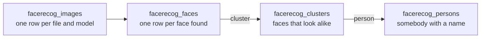

# Data model

Four tables, and the distinction that matters is between the last two: a cluster
is a set of faces that look alike, and a person is somebody with a name. They
are not the same thing, and one person has as many clusters as different ways
their face was found.

## facerecog_images

One row per file and model: `user`, `file`, `model`, `is_processed`, `error`,
`last_processed_time`, `processing_duration`.

A file analyzed with two models has two rows. The model of everything else is
read from here or copied from it.

## facerecog_faces

One row per face found in an image: its rectangle, its `landmarks`, its 128
dimensional `descriptor`, the `confidence` of the detection, `is_groupable`, and
the `cluster` it belongs to.

`cluster` is the cluster of faces that look alike this one. Who that cluster is,
if the user already said, is the `person` of the cluster, one table further. The
column was called `person` until 0.9.93, from the time both were the same row.

A face is not grouped with anything when it is smaller than `min_face_size`, its
confidence is below `min_confidence`, or the user detached it, which sets
`is_groupable` to false. Those faces get a cluster of their own and are never
compared, so they cannot attract other faces into it.

## facerecog_clusters

A set of faces of one model that look alike: `user`, `model`, `is_visible`, and
`person`.

`person` is null until the user says who the cluster is. `is_visible` is false
when the user chose to ignore it, and ignoring also clears `person`.

A cluster keeps its id for as long as it has faces. The clustering only ever
adds faces to it, with one exception: when two clusters turn out to be the same
appearance of one person, the bigger one absorbs the other and the absorbed id
disappears. See [clustering.md](clustering.md).

## facerecog_persons

Somebody the user named: `user` and `name`.

Several clusters point at one row, which is the point of the table. Two people
of the same user can carry the same name, and they are still two people. A row
that no cluster points at any more is deleted.

## History

Before 0.9.92 there was no `facerecog_clusters`: a row of `facerecog_persons`
was a cluster, and the person was the `name` repeated in every cluster of
theirs. Renaming meant one statement per cluster, listing the people meant one
query per name, and two people called the same were one.

Five migrations do the change, and they run in this order:

| migration | what it does |
| --- | --- |
| `Version0990Date20260731120000` | Adds `model` to the cluster row, so that the seven queries that carried an `EXISTS (SELECT 1 FROM faces JOIN images ...)` only to find it out do not need it. Drops `is_valid`, which nothing invalidates any more, and `last_generation_time` and `linked_user`, which were only ever written. |
| `Version0992Date20260731130000` | Creates `facerecog_clusters`, moves the clusters there, repoints the faces, and leaves one row per name in `facerecog_persons` with the clusters pointing at it. |
| `Version0992Date20260731130001` | Leaves `facerecog_persons` with `id`, `user` and `name`. |
| `Version0993Date20260731160000` | Adds `facerecog_faces.cluster` and copies `person` into it. |
| `Version0993Date20260731160001` | Drops `facerecog_faces.person`. |

The clusters get **new ids** on the way, so a link or an API client that kept a
cluster id has to ask for it again. Names are not affected.

Two details of the second migration are worth knowing before touching it. The
faces are repointed in two passes, writing the new id negated first and flipping
the sign at the end, because a new id can collide with an old one still in the
column. And the people reuse the ids of the old rows instead of being inserted
with an explicit id, so no autoincrement sequence is left behind, which is what
would break on PostgreSQL.
